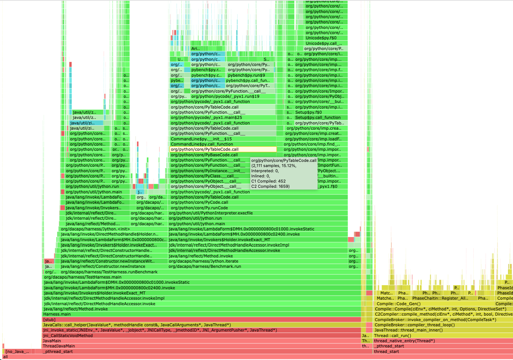

# AsyncGetCallTrace Extension Demo

This project showcases the ideas behind the drafted extension of the AsyncGetCallTrace
call and combines the modified [JDK](https://github.com/parttimenerd/jdk/tree/parttimenerd_asgct2)
and the related [async-profiler fork](https://github.com/SAP/async-profiler/tree/parttimenerd_asgct2)
which uses the API.

## TLDR
I propose 
- [to unify all profiling related stack walking in a new class](#unify-stack-walking) (less code duplication and more error checking)
- [the extension of AsyncGetCallTrace (AsyncGetCallTrace2)](#asyncgetcalltrace-extension) with a Class Path exception and more information on Java and non Java frames

## Build

Either build the JDK in the folder `jdk` as you would usually do
(it's a JDK 19, release builds are recommended) 
and build the async-profiler in the folder 
`async-profiler` via make or run `./build.sh`.
Be sure to install the required dependencies (you will probably
see related error messages if you don't).

*It is based on OpenJDK head but the changes should be easy to backport to previous versions.*

## Demo Script

`./run.sh AGENT_ARGS JAVA_ARGS...` which uses the built JDK and async-profiler.

For example, to run a [dacapo](https://github.com/dacapobench/dacapobench) benchmark, e.g jython, and generate a flame graph run

```sh
test -e dacapo.jar || wget https://downloads.sourceforge.net/project/dacapobench/9.12-bach-MR1/dacapo-9.12-MR1-bach.jar -O dacapo.jar

./run.sh flat=10,traces=1,interval=500us,event=cpu,flamegraph,file=flame.html -jar dacapo.jar jython
```
*With an interval of 500us (0.5ms), more information on the arguments in the [async-profiler](https://github.com/SAP/async-profiler/tree/parttimenerd_asgct2).
Use another benchmark like tomcat instead of jython, if the flame graph misses the bottom frames.*

This results in a flame graph like (click on the image to get to the HTML flame graph):

[](https://htmlpreview.github.io/?https://github.com/parttimenerd/asgct2-demo/blob/main/img/jython.html)

The usage of the new draft AsyncGetCallTrace gives us the following additions to a normal
async-profiler flame graph: Information on the compilation stage (C1 vs C2 compiler),
inlining information for non-top frames, and the c frames starting with `_pthread_start`
up to the first Java frame. This information was previously unobtainable by async-profiler
(or any other profiler using just JFR or AsyncGetCallTrace).

The same flame graph using the old AsyncGetCallTrace can be found [here](img/jython_old.png) 
(using [async-profiler](https://github.com/SAP/async-profiler/tree/distinguish_inlined_frames2)
that includes the hover texts).


## Technical Aspects 

I propose to

1. Replace duplicated stack walking code with unified API
3. Create a new AsyncGetCallTrace extension with Classpath Exception and more information on frames

### Unify Stack Walking

There are currently multiple implementations of stack walking in JFR and for AsyncGetCallTrace. 
They each implement their own extension of vframeStream but with comparable features
and check for problematic frames.

My proposal is therefore to replace the stack walking code with a unified API that
includes all error checking and vframeStream extensions in a single place.
The prosposed new class is called StackWalker and could be part of
`jfr/recorder/stacktrace` [1]. 
This class also supports getting information on C frames so it can be potentially
used for walking stacks in VMError (used to create hs_err files), further
reducing the amount of different stack walking code.

### AsyncGetCallTrace Extension

The AsyncGetCallTrace call has seen increasing use in recent years.
But its licensing makes it hard to properly integrate in Open Source
software and the information on frames it returns is pretty limited 
(only the method and bci for Java frames) which makes implementing
profilers and other tooling harder. Tools (like async-profiler)
have to resort to complicated code to partially obtain the information
that the JVM already has.

The licensing issue can be solved by licensing the new API with
a ClassPath Exception. Furthermore, using the proposed StackWalker
class, implementing a new API that returns more information on frames
is possible with a small amount of code.

The working title for the new extension is "AsyncGetCallTrace2" 
currently placed `share/prims/asgct2` [2].
The following describes the proposed API:

```cpp
void AsyncGetCallTrace2(ASGCT_CallTrace2 *trace, jint depth, void* ucontext);**
```

The structure of `ASGCT_CallTrace2` is the same as the original
`ASGCT_CallTrace` with the same error codes encoded in <= 0
values of `num_frames`.

```cpp
typedef struct {
  JNIEnv *env_id;                   // Env where trace was recorded
  jint num_frames;                  // number of frames in this trace
  ASGCT_CallFrame2 *frames;         // frames
} ASGCT_CallTrace2;
```

The only difference is that the `frames` array also contains
information on C frames.

Currently `ASGCT_CallFrame2` is implemented in the prototype as

```cpp
typedef struct {
  jint bci;                   // bci for Java frames
  jmethodID method_id;        // method ID for Java frames
  // new information
  void *machine_pc;            // program counter, for C and native frames (frames of native methods)
  FrameTypeId type : 8;       // frame type (single byte)
  CompLevel comp_level: 8;    // highest compilation level of a method related to a Java frame (one byte)
} ASGCT_CallFrame2;
```

The `FrameTypeId` is based on the frame type in JFRStackFrame:

```cpp
enum FrameTypeId {
  FRAME_INTERPRETED = 0,
  FRAME_JIT         = 1,
  FRAME_INLINE      = 2,
  FRAME_NATIVE      = 3,
  FRAME_CPP         = 4
};
```

The `CompLevel` is the compilation level defined in `compiler/compilerDefinitions`:

```cpp
// Enumeration to distinguish tiers of compilation
enum CompLevel {
  CompLevel_any               = -1,        // Used for querying the state
  CompLevel_all               = -1,        // Used for changing the state
  CompLevel_none              = 0,         // Interpreter
  CompLevel_simple            = 1,         // C1
  CompLevel_limited_profile   = 2,         // C1, invocation & backedge counters
  CompLevel_full_profile      = 3,         // C1, invocation & backedge counters + mdo
  CompLevel_full_optimization = 4          // C2 or JVMCI
};
```

The traces produced by this prototype are fairly large
(each frame requires 22 is instead of 12 bytes). The reason
for this is that it simplified the extension of async-profiler.

But packing the information is of course possible:

```cpp
typedef struct {         
  jmethodID method_id;
  uint16_t bci;            // 0 < bci < 65536
  FrameTypeId type : 8;
  CompLevel comp_level: 8;
} JavaFrame;

typedef struct {
  void *machine_pc
  FrameTypeId type: 8;
} CFrame;

typedef union {
  JavaFrame java_frame;
  CFrame c_frame;
} ASGCT_CallFrame2;
```

This uses the same amount of space per frame (12 bytes) as the original but encodes far more information.

[1] https://github.com/parttimenerd/jdk/blob/parttimenerd_asgct2/src/hotspot/share/jfr/recorder/stacktrace/stackWalker.hpp

[2] https://github.com/parttimenerd/jdk/blob/parttimenerd_asgct2/src/hotspot/share/prims/asgct2.cpp
