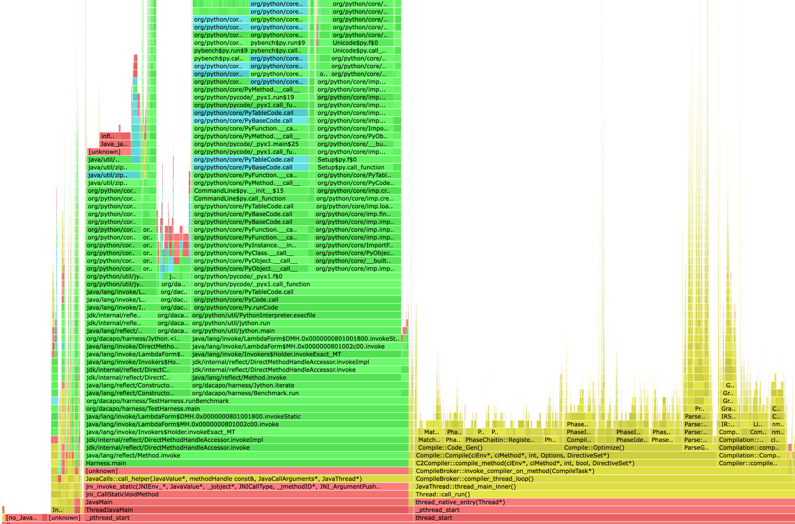

# New Version of AsyncGetCallTrace

I propose to

1. Replace duplicated stack walking code with unified API
2. Create a new version of AsyncGetCallTrace, tentatively called "AsyncGetCallTrace2", with more information on more frames using the unified API

Skip to the [Demo section](#demo) if you want to see a prototype of this proposal in action.

### Unify Stack Walking

There are currently multiple implementations of stack walking in JFR and for AsyncGetCallTrace. 
They each implement their own extension of vframeStream but with comparable features
and check for problematic frames.

My proposal is therefore to replace the stack walking code with a unified API that
includes all error checking and vframeStream extensions in a single place.
The prosposed new class is called StackWalker and could be part of
`jfr/recorder/stacktrace` [1]. 
This class also supports getting information on C frames so it can be potentially
used for walking stacks in VMError (used to create hs_err files), further
reducing the amount of different stack walking code.

### AsyncGetCallTrace2

The AsyncGetCallTrace call has seen increasing use in recent years
in profilers like async-profiler.
But it is not really an API (not exported in any header) and
the information on frames it returns is pretty limited 
(only the method and bci for Java frames) which makes implementing
profilers and other tooling harder. Tools like async-profiler
have to resort to complicated code to partially obtain the information
that the JVM already has.
Information that is currently hidden and impossible to obtain is

- whether a compiled frame is inlined (currently only obtainable for the top most compiled frames)
  -  although this can be obtained using JFR 
- C frames that are not at the top of the stack
- compilation level (C1 or C2 compiled)

This information is helpful when profiling and tuning the VM for
a given application and also for profiling code that uses
JNI heavily.

Using the proposed StackWalker class, implementing a new API 
that returns more information on frames is possible 
as thin wrapper over the StackWalker API [2]. 
This also improves the maintainability as the code used
in this API is used in multiple places and is therefore
also better tested than the previous implementation, see 
[1] for the implementation.

The following describes the proposed API:

```cpp
void AsyncGetCallTrace2(asgct2::CallTrace *trace, jint depth, void* ucontext);
```

The structure of `CallTrace` is the same as the original
`ASGCT_CallTrace` with the same error codes encoded in <= 0
values of `num_frames`.

```cpp
typedef struct {
  JNIEnv *env_id;                   // Env where trace was recorded
  jint num_frames;                  // number of frames in this trace
  CallFrame *frames;                // frames
  void* frame_info;                 // more information on frames
} CallTrace;
```

The only difference is that the `frames` array also contains
information on C frames and the field `frame_info`.
The `frame_info` is currently null and can later be used
for extended information on each frame, being an array with
an element for each frame. But the type of the
elements in this array is implementation specific.
This akin to `compile_info` field in JVMTI's CompiledMethodLoad 
[3] and used for extending the information returned by the
API later.

Currently `CallFrame` is implemented in the prototype [4] as

```cpp
typedef struct {
  jint bci;                   // bci for Java frames
  jmethodID method_id;        // method ID for Java frames
  // new information
  void *machine_pc;           // program counter, for C and native frames (frames of native methods)
  FrameTypeId type;           // frame type (single byte)
  uint8_t comp_level;         // highest compilation level of a method related to a Java frame
} CallFrame;
```

The `FrameTypeId` is based on the frame type in JFRStackFrame:

```cpp
enum class FrameTypeId : uint8_t {
  FRAME_INTERPRETED = 0, 
  FRAME_JIT         = 1, // JIT compiled
  FRAME_INLINE      = 2, // inlined JITed methods
  FRAME_NATIVE      = 3, // native wrapper to call C methods from Java
  FRAME_CPP         = 4  // c/c++/... frames, stub frames have CompLevel_all
};
```

The `comp_level` states the compilation level of the method related to the frame:
There are two special level `256` represents the inlined level and `0`
the interpreted level. On the inlined level, the method has the same
compilation level as the calling method.
All levels between give the level of compilation where
higher numbers represent more compilation. It is modelled after 
the `CompLevel` enum in `compiler/compilerDefinitions`:

```cpp
// Enumeration to distinguish tiers of compilation
enum CompLevel {
  CompLevel_any               = -1, // = 256  // Used for querying the state
  CompLevel_all               = -1,        // Used for changing the state
  CompLevel_none              = 0,         // Interpreter
  CompLevel_simple            = 1,         // C1
  CompLevel_limited_profile   = 2,         // C1, invocation & backedge counters
  CompLevel_full_profile      = 3,         // C1, invocation & backedge counters + mdo
  CompLevel_full_optimization = 4          // C2 or JVMCI
};
```

The traces produced by this prototype are fairly large
(each frame requires 22 is instead of 12 bytes) and some data is
duplicated.
The reason for this is that it simplified the extension of async-profiler
for the prototype, as it only extends the data structures of
the original AsyncGetCallTrace API.

But packing the information and reducing duplication is of course possible
if we step away from the former constraint:

```cpp
enum class FrameTypeId : uint8_t {
  FRAME_JAVA        = 1, // JIT compiled and interpreted
  FRAME_NATIVE      = 2, // native wrapper to call C methods from Java
  FRAME_STUB        = 3, // VM generated stubs
  FRAME_CPP         = 4  // c/c++/... frames
};

typedef struct {     
  FrameTypeId type;        // single byte type
  uint8_t comp_level;      // with 256 stating this frame is inlined (and compiled)
  uint16_t bci;            // 0 < bci < 65536
  jmethodID method_id;
} JavaFrame;

typedef struct {
  FrameTypeId type;     // single byte type
  uint8_t padding[3];   // padding so that machine_pc is 4 byte aligned
  void *machine_pc;
} NonJavaFrame;         // used for FRAME_NATIVE, FRAME_STUB and FRAME_CPP

typedef union {
  FrameTypeId type;
  JavaFrame java_frame;
  NonJavaFrame non_java_frame;
} CallFrame;
```

This uses the same amount of space per frame (12 bytes) as the original but encodes far more information.

[1] https://github.com/parttimenerd/jdk/blob/parttimenerd_asgct2/src/hotspot/share/jfr/recorder/stacktrace/stackWalker.hpp

[2] https://github.com/parttimenerd/jdk/blob/parttimenerd_asgct2/src/hotspot/share/prims/asgct2.cpp****

[3] https://docs.oracle.com/javase/8/docs/platform/jvmti/jvmti.html#CompiledMethodLoad

[4] https://github.com/parttimenerd/jdk/blob/parttimenerd_asgct2/src/hotspot/share/prims/asgct2.hpp


## Demo

This project showcases the ideas behind the drafted extension of the AsyncGetCallTrace
call and combines the modified [JDK](https://github.com/parttimenerd/jdk/tree/parttimenerd_asgct2)
and the related [async-profiler fork](https://github.com/SAP/async-profiler/tree/parttimenerd_asgct2)
which uses the API.

### Build

Either build the JDK in the folder `jdk` as you would usually do
(it's a JDK 19, release builds are recommended) 
and build the async-profiler in the folder 
`async-profiler` via make or run `./build.sh`.
Be sure to install the required dependencies (you will probably
see related error messages if you don't).

*It is based on OpenJDK head but the changes should be easy to backport to previous versions.*

### Demo Script

`./run.sh AGENT_ARGS JAVA_ARGS...` which uses the built JDK and async-profiler.

For example, to run a [dacapo](https://github.com/dacapobench/dacapobench) benchmark, e.g jython, and generate a flame graph run

```sh
test -e dacapo.jar || wget https://downloads.sourceforge.net/project/dacapobench/9.12-bach-MR1/dacapo-9.12-MR1-bach.jar -O dacapo.jar

./run.sh flat=10,traces=1,interval=500us,event=cpu,flamegraph,file=flame.html -jar dacapo.jar jython
```
*With an interval of 500us (0.5ms), more information on the arguments in the [async-profiler](https://github.com/SAP/async-profiler/tree/parttimenerd_asgct2).
Use another benchmark like tomcat instead of jython, if the flame graph misses the bottom frames.*

This results in a flame graph like (click on the image to get to the HTML flame graph):

[](https://htmlpreview.github.io/?https://github.com/parttimenerd/asgct2-demo/blob/main/img/jython.html)

The usage of the new draft AsyncGetCallTrace gives us the following additions to a normal
async-profiler flame graph: Information on the compilation stage (C1 vs C2 compiler),
inlining information for non-top frames, and the c frames starting with `_pthread_start`
up to the first Java frame. This information was previously unobtainable by async-profiler
(or any other profiler using just JFR or AsyncGetCallTrace).

The same flame graph using the old AsyncGetCallTrace can be found [here](img/jython_old.png) 
(using [async-profiler](https://github.com/SAP/async-profiler/tree/distinguish_inlined_frames2)
that includes the hover texts).
